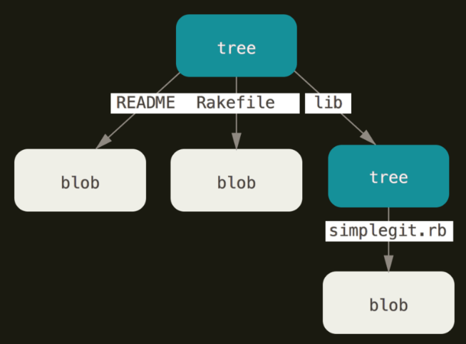
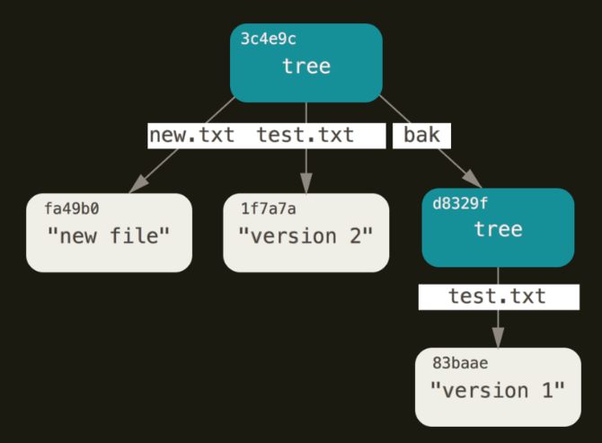

# Git and GitHub

## Git and Github are different
**Git**
- Git is a version control system that is used to track changes to your files.
- It is free and open-source software that is available for Linux, Windows and macOS.
- Since git is a software it can be installed on any computer.

**Github**
- Github is a web-based hosting service for Git repositories.
- Github is an online platform that allow you to store and share your code with others.
- Github is the popular provider of Git repositories.

## Version Control System
Version control systems are used to manage the history of your code. They allow you to track changes to your files and to collaborate with others.

Version control systems are essential for the software development. You can go back to previous code at any time.

## Before Git
Before Git became mainstream, version control systems were used by developers to manage their code. They were called **SCCS (Source Code Control System)**

SCCS was a propriety software that was used to manage the history of code. It was expensive and not user-freindly. 

Git was created to replace SCCS and to make version control more accessible and user-friendly.

Some common version control systems are 
- Subversion(SVN)
- CVS
- Perforce
- Mercury


## Installing GIt
To download and install Git using the terminal, follow these steps:

###### **For Windows:**

Open the Command Prompt: Press the Windows key + R to open the Run dialog box, type cmd, and press Enter.
Download the Git installer: Run the following command to download the latest version of Git for Windows:
```
powershell -Command "Invoke-WebRequest -Uri https://github.com/git-for-windows/git/releases/download/v2.37.0.windows.1/ Git-2.37.0.1-64-bit.exe -OutFile Git-2.37.0.1-64-bit.exe"
```

Replace the version number with the latest version available. 3. Install Git: Run the downloaded installer by typing:
```
Git-2.37.0.1-64-bit.exe
```

Follow the installation prompts to complete the installation. 4. Verify the installation: Open a new Command Prompt and type:
```
git --version
```

This should display the version of Git installed on your system.

###### **For macOS (using Homebrew):**

Open the Terminal: You can find Terminal in the Applications/Utilities folder, or use Spotlight to search for it.
Install Homebrew: If you don’t have Homebrew installed, run the following command:
```
/bin/bash -c "$(curl -fsSL https://raw.githubusercontent.com/Homebrew/install/HEAD/install.sh)"
```

Install Git: Run the following command to install Git using Homebrew:
```
brew install git
```

Verify the installation: Open a new Terminal and type:
```
git --version
```

This should display the version of Git installed on your system.

###### **For Linux:**

Open the Terminal: You can find Terminal in the Applications/Utilities folder, or use Spotlight to search for it.
Install Git: Run the following command to install Git:
```
sudo apt-get install git
```

For Ubuntu-based systems, use:
```
sudo apt-get update && sudo apt-get install git
```

For Red Hat-based systems, use:
```
sudo yum install git
```

Verify the installation: Open a new Terminal and type:
```
git --version
```

This should display the version of Git installed on your system

Git is available for Windows, macOS, and Linux and is available at https://git-scm.com/downloads.

## Account Github


## Terminoly
#### CHeck your git version
To check your git version, you can run the following command:

```
git --version
```

This  command will display the version of the git installed on your system.

Git is a very stable software and don't get any breaking changes in majority of the cases.

#### Repository
A repository is a collection of files and directories that are stored together. It is away to store and manage your code.

A repository is like a folder on your computer, but it is more than just a folder.

It contain other files, folders, and evevn **other repositories**.

There is a difference betweeen a software on your system vs tracking a particular folderon your system.

At any point you can run the following command to see the current state of your repository
```
git status
```

There are two types of folders
1. Tracked folder
2. Untracked folder


#### Your config setting
1. Setup your email and username in the config file
```
git config --global user.email "your-email@example.com"
git config --global user.name "Your Name"
```

2. Check your config setting
```
git config --list
```

This will show you all the setting that you have changed.

#### Creating a repository
Creating a repository is a process of creating a new folder on your system and initializing it as a git repository. It’s just regular folder to code your project, you are just asking git to track it. 

To create a repository, you can use the following command:
```
git status
git init
```

`git status` command will show you the current state of your repository.

`git init` command will create a new folder on your system and initialise it as a git repository. This adds a hidden `.git` folder to your project.

#### Commit
Commit is a way to save your chnages to your repository. It is a way to record your changes and make them permanent. 
Commit is just like a snaphot of your code at a particular point in time.
When you commit your changes, you are telling git to save them in a permanent way. This way, you can always go back to that point in time and see what you changed.

Usual flow is look like :


## Complte git flow
A complete git flow, along with pushing the code to github looks like this:


When you want to track a new folder, you first use `init` command to create a new repository. Then you can use `git add` command to add the folder to the repository. After that you can use  `commit` command to save the changes. Finally you can use the `push` command ti push the changes to github. Ofcourse there is more to it but this is the basic flow.

## Stage
Stage is a way to tell git to track a particular file or folder. You can use the following command to stage a file:
```
git init
git add <file1> <file2>
git status
```

Here we are initializing the repository and adding a file to the repository. Then we can see that the file is now being tracked by git. Currently our files are in staging area, this means that we have not yet committed the changes but are ready to be committed.


## Commit
```
git commit -m "commit message"
git status
```

Here we are committing the changes to the repository. We can see that the changes are now committed to the repository. The `-m` flag is used to add a message to the commit. This message is a short description of the changes that were made. You can use this message to remember what the changes were. Missing the `-m` flag will result in an action that opens your default settings editor, which is usually VIM. We can  change this to vscode or any other editor.

## Log
```
git log
```
This command will show you the history of your repository. It will show you all the commits that were made to the repository. You can use the `--oneline` flag to show only the commit message. This will make the output more compact and easier to read.

#### Atomic Commits
`Atomic commits are a way to make sure that each commit is a self-contained unit of work. This means that if one commit fails, you can always go back to a previous commit and fix the issue. This is important for maintaining a clean and organized history in your repository.`

## Change default code editor
You can change the deafult code editor in your system to vscode. To do this, you can use the following command:
```
git config --global core.editor "code --wait"
```

### gitignore
Gitignore is a file that tells git which files and folders to ignore. It is a way to prevent git from tracking certain files or folders. You can create a gitignore file and add list of files and folders to ignore by using the following command:

Example:
```
node_module
.env
.vscode
```

Now, when you run the `git status` command, it will not show the `node_modules` and `.vscode` folders as being tracked by git.


