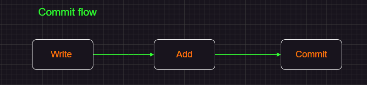
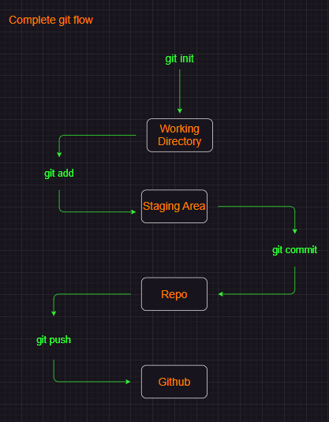
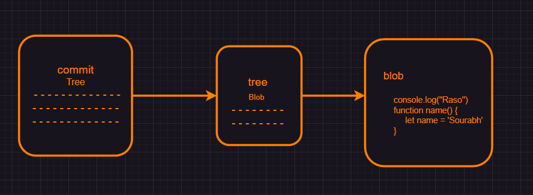
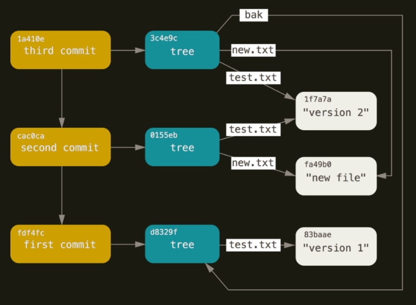
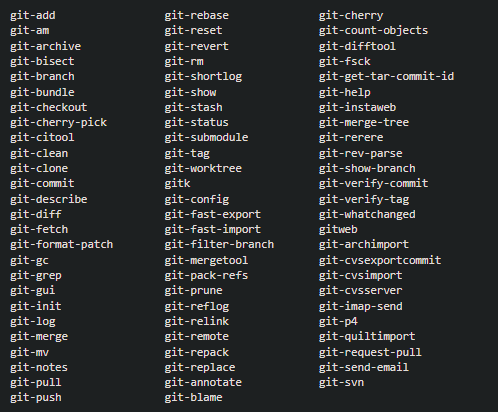
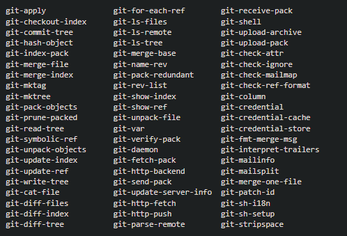
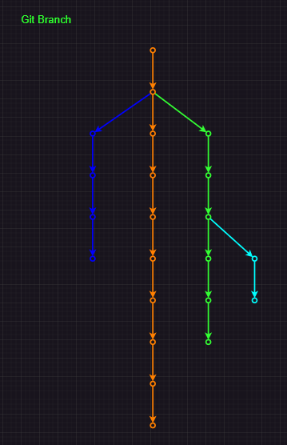
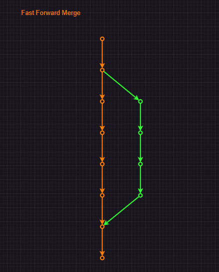
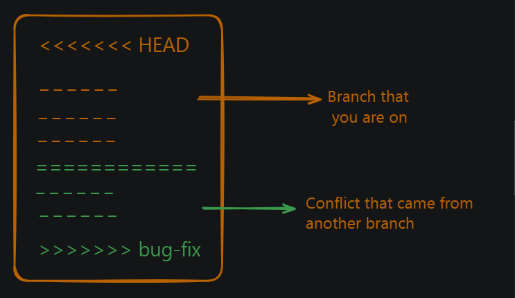

# Git 
## Git and GitHub

### Git and Github are different
**Git**
- Git is a version control system that is used to track changes to your files.
- It is free and open-source software that is available for Linux, Windows and macOS.
- Since git is a software it can be installed on any computer.

**Github**
- Github is a web-based hosting service for Git repositories.
- Github is an online platform that allow you to store and share your code with others.
- Github is the popular provider of Git repositories.

### Version Control System
Version control systems are used to manage the history of your code. They allow you to track changes to your files and to collaborate with others.

Version control systems are essential for the software development. You can go back to previous code at any time.

### Before Git
Before Git became mainstream, version control systems were used by developers to manage their code. They were called **SCCS (Source Code Control System)**

SCCS was a propriety software that was used to manage the history of code. It was expensive and not user-freindly. 

Git was created to replace SCCS and to make version control more accessible and user-friendly.

Some common version control systems are 
- Subversion(SVN)
- CVS
- Perforce
- Mercury


### Installing GIt
To download and install Git using the terminal, follow these steps:

###### **For Windows:**

Open the Command Prompt: Press the Windows key + R to open the Run dialog box, type cmd, and press Enter.
Download the Git installer: Run the following command to download the latest version of Git for Windows:
```
powershell -Command "Invoke-WebRequest -Uri https://github.com/git-for-windows/git/releases/download/v2.37.0.windows.1/ Git-2.37.0.1-64-bit.exe -OutFile Git-2.37.0.1-64-bit.exe"
```

Replace the version number with the latest version available. 3. Install Git: Run the downloaded installer by typing:
```
Git-2.37.0.1-64-bit.exe
```

Follow the installation prompts to complete the installation. 4. Verify the installation: Open a new Command Prompt and type:
```
git --version
```

This should display the version of Git installed on your system.

###### **For macOS (using Homebrew):**

Open the Terminal: You can find Terminal in the Applications/Utilities folder, or use Spotlight to search for it.
Install Homebrew: If you don’t have Homebrew installed, run the following command:
```
/bin/bash -c "$(curl -fsSL https://raw.githubusercontent.com/Homebrew/install/HEAD/install.sh)"
```

Install Git: Run the following command to install Git using Homebrew:
```
brew install git
```

Verify the installation: Open a new Terminal and type:
```
git --version
```

This should display the version of Git installed on your system.

###### **For Linux:**

Open the Terminal: You can find Terminal in the Applications/Utilities folder, or use Spotlight to search for it.
Install Git: Run the following command to install Git:
```
sudo apt-get install git
```

For Ubuntu-based systems, use:
```
sudo apt-get update && sudo apt-get install git
```

For Red Hat-based systems, use:
```
sudo yum install git
```

Verify the installation: Open a new Terminal and type:
```
git --version
```

This should display the version of Git installed on your system

###### Download git using GUI:
Git is available for Windows, macOS, and Linux and is available at https://git-scm.com/downloads.

### Account Github

##

## Terminoly
### CHeck your git version
To check your git version, you can run the following command:

```
git --version
```

This  command will display the version of the git installed on your system.

Git is a very stable software and don't get any breaking changes in majority of the cases.

### Repository
A repository is a collection of files and directories that are stored together. It is away to store and manage your code.

A repository is like a folder on your computer, but it is more than just a folder.

It contain other files, folders, and evevn **other repositories**.

There is a difference betweeen a software on your system vs tracking a particular folderon your system.

At any point you can run the following command to see the current state of your repository
```
git status
```

There are two types of folders
1. Tracked folder
2. Untracked folder


### Your config setting
1. Setup your email and username in the config file
```
git config --global user.email "your-email@example.com"
git config --global user.name "Your Name"
```

2. Check your config setting
```
git config --list
```

This will show you all the setting that you have changed.

### Creating a repository
Creating a repository is a process of creating a new folder on your system and initializing it as a git repository. It’s just regular folder to code your project, you are just asking git to track it. 

To create a repository, you can use the following command:
```
git status
git init
```

`git status` command will show you the current state of your repository.

`git init` command will create a new folder on your system and initialise it as a git repository. This adds a hidden `.git` folder to your project.

### Commit
Commit is a way to save your chnages to your repository. It is a way to record your changes and make them permanent. 
Commit is just like a snaphot of your code at a particular point in time.
When you commit your changes, you are telling git to save them in a permanent way. This way, you can always go back to that point in time and see what you changed.

Usual flow is look like :


### Complte git flow
A complete git flow, along with pushing the code to github looks like this:


When you want to track a new folder, you first use `init` command to create a new repository. Then you can use `git add` command to add the folder to the repository. After that you can use  `commit` command to save the changes. Finally you can use the `push` command ti push the changes to github. Ofcourse there is more to it but this is the basic flow.

### Stage
Stage is a way to tell git to track a particular file or folder. You can use the following command to stage a file:
```
git init
git add <file1> <file2>
git status
```

Here we are initializing the repository and adding a file to the repository. Then we can see that the file is now being tracked by git. Currently our files are in staging area, this means that we have not yet committed the changes but are ready to be committed.


### Commit
```
git commit -m "commit message"
git status
```

Here we are committing the changes to the repository. We can see that the changes are now committed to the repository. The `-m` flag is used to add a message to the commit. This message is a short description of the changes that were made. You can use this message to remember what the changes were. Missing the `-m` flag will result in an action that opens your default settings editor, which is usually VIM. We can  change this to vscode or any other editor.

### Log
```
git log
```
This command will show you the history of your repository. It will show you all the commits that were made to the repository. You can use the `--oneline` flag to show only the commit message. This will make the output more compact and easier to read.

#### Atomic Commits
  Atomic commits are a way to make sure that each commit is a self-contained unit of work. This means that if one commit fails, you can always go back to a previous commit and fix the issue. This is important for maintaining a clean and organized history in your repository.

for more info : https://git-scm.com/docs/git-log

### Change default code editor
You can change the deafult code editor in your system to vscode. To do this, you can use the following command:
```
git config --global core.editor "code --wait"
```

### gitignore
Gitignore is a file that tells git which files and folders to ignore. It is a way to prevent git from tracking certain files or folders. You can create a gitignore file and add list of files and folders to ignore by using the following command:

Example:
```
node_module
.env
.vscode
```

Now, when you run the `git status` command, it will not show the `node_modules` and `.vscode` folders as being tracked by git.

##

## Git behind the scene (Git Internals)
Git is a version control system that allows you to track changes to your files and folders. It is a powerful tool that can help you manage your code more effectively. In this section, we will explore the basics of how git works internally.

### Git Snapshots
A git snapshot is a point in time in the history of your code. It represents a specific version of your code, including all the files and folders that were present at that time. Each snapshot is identified by a unique hash code, which is a string of characters that represents the contents of the snapshot.

A snapshot is not an image, it’s just a representation of the code at a specific point in time. Snapshot is a loose term that is used when git stores information about the code in a locally stored key-value based database. Everything is stored as an object and each object is identified by a unique hash code.

### 3 Musketeers of git
The three musketeers of git are;
- Commit Object
- Tree Object
- Blob Object

### Commit Object
Each commit in the project is stored in `.git` folder in the form of a commit object. A commit object contains the following information:
- Tree Object
- Parent Commit Object
- Author
- Committer
- Commit Message

### Tree Object
Tree Object is a container for all the files and  folders in the project. It contains the following
- File Mode
- File Name
- File Hash
- Parent Tree Object

Everything is stored as key-value pairs in the tree object. The key is the file name and the value is the file hash.

### Blob Object
Blob Object is present in the tree object and contains the actual file content. This is the place where the file content is stored.



### Helpfull Commands
Here are some helpfull commands that you can use to explore the **git internals**:
```
git log --oneline
```

Grab commit hash from  the above command and use it in the following command:
``` 
git show -s --pretty=raw <commit-hash>
```

Grab tree id from  the above command and use it in the following command to get the tree object:
```
git ls-tree <tree-id>
```

Grab blob id from  the above command and use it in the following command to get the blob object:
```
git show <blob-id>
```

Grab tree id from the above command and use it in the following command to get the commit object:
```
git cat-file -p <commit-id>
```

### Data in git 
Conceptually, the data that Git is storing looks something like this:




### Types of commands in git
1. Porcelain



2. Plumbing



3. Gardening Command (not sure about it)

### How to done things in git (without any interface)
```
git init
git status
touch example.txt
git status
```
Output is untracked files

To tracked the untracked file(stage version)
Before interface:
1. **Create unique commit id** (using a unique sha variable sha1)
```
sha1=$(git hash-object -w example.txt)
$sha1
```

2. **Maintaing the indexing of git**
```
git update-index --add --cacheinfo 100644 $sha1 example.txt
```

Now `example.txt` is added to staged area. You can check using:
```
git status
```
3. **Making tree**
```
tree=$(git write-tree)
commit=$(echo "Initial Commit" | git commit-tree $tree)
git update-ref HEAD $commit
```

Now `example.txt` is committed. You can check using :
```
git status
``` 
Nothing to commit is the output.

```
git log --online
```

## Branches in git
### Branches in git
branches are a way to work on different version of a project at the same time. They allow you to create  a separate line of development that can be worked on independently of the main branch. This can be useful when you want to make changes to a project without affecting the main branch or when you want to work on a new feature or bug fix.



Some developers can work on Header, some can work on Footer, some can work on Content, and some can work on Layout. This is a good example of how branches can be used in git.

### HEAD in git
The `HEAD` is a pointer to the current branch that you are working on. It points to the latest commit in the current branch. When you create a new branch, it is automatically set as the `HEAD` of that branch.

**Note:** The default branch used to be called `master`, but it is now called `main`. There is nothing special about `main`; it is just a convention.

### Creating a new Branch
To create a new branch, you can use the following command
```
git branch
git branch bug-fix
git switch bug-fix
git log
git switch master
git switch -c dark-mode
git checkout orange-mode
```

Some points to note:
- `git branch` - This command lists all the branches in the current repository.
- `git branch bug-fix` - This command create a new branch called `bug-fix`.
- `git switch bug-fix` - This command switches to the `bug-fix` branch.
- `git log` - This command shows the commit history for the current branch.
- `git switch master` - This command switches to the master branch.
- `git switch -c dark-mode` - This command creates a new branch called `dark-mode`. the `-c` flag is used to create a new branch.
- `git checkout orange-mode` - This command switches to the orange-mode branch.
 - Commit before switching to a branch
 - Go to .git folder and checkout to the HEAD file


### Merging branches
#### **Fast_forward merge**
This one is easy as branch that you are trying to merge is usually ahead and there are no conflicts.

When you are done working on a branch, you can merge it back into the main branch. This is done using the following command:
```
git checkout main
git merge bug-fix
```


Some points to note:
- `git checkout main` - This command switches to the `main` branch.
- `git merge bug-fix` - This command merges the `bug-fix` branch into the `main` branch.

This is a fast-forward merge. It means that the commit in the `bug-fix` branch are directly merged into the `main` branch. This can be useful when you want to merge a branch that has already been pushed to the remote repository.

#### **Not Fast-forward merge**


In this type of merge, the master branch also worked and have some commits that are not in the `bug-fix` branch. This is a not fast-forward merge.

When you are done working on a branch, you can merge it back into the main branch. This is done using the the following command:
``` 
git checkout main
git merge bug-fix
```
Since the command for the fast-forward and not fast-forward merge are same, the only difference between is how you resolve the conflicts.

In a fast-forward merge, there are no conflicts.But in a not fast-forward merge, there are conflicts, and there are no shortcuts to resolve them. You have to manually resolve the conflits. Decide, what to keep and what to discard. VSCode has a built-in merge tool that can help you resolve thr conflits.




### Managing conflits
There is no magic button to resolve conflicts. You have to manually resolve the conflits. Decide, what to keep and what to discard. VSCode has a built-in merge tool that can help you resolve the conflicts. I personally use VSCode merge tool. Github also has a merge tool that can help you resolve the conflicts but most of the time I handle them in VSCode and it gives me all the options to resolve the conflicts.

Overall it sounds scary to beginners but it is not, it’s all about communication and understanding the code situation with your team members.

### Rename a branch
You can rename a branch using the following command:
```
git branch -m <old-branch-name> <new-branch-name>
```

### Delete a branch
You can delete a branch using the following command:
```
git branch -d <branch-name>
```

### Checkout a branch
You can checkout a branch using the following command:
``` 
git checkout <branch-name>
```

Checkout a branch means that you are going to work on that branch, You can checkout any branch you want.

### List all branches
You can list all the branches using the following command:
```
git branch
```

List all the branch means that you are going to see all the branches in your repository.

## diff stash and Tags
### Git diff


